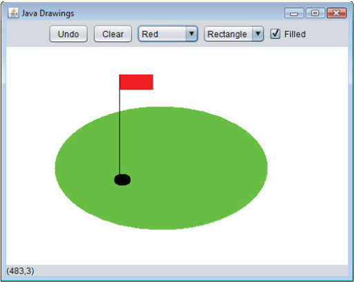

# 1217-aplicativo-desenho-interativo
Neste exercício, você implementará um aplicativo GUI que usa a hierarquia MyShape do Exercício de estudo de caso de GUIs e imagens gráficas 10.2 para criar um aplicativo de desenho interativo. 
Você criará duas classes para a GUI
e fornecerá uma classe de teste que carrega o aplicativo. As classes da hierarquia MyShape não exigem nenhuma alteração adicional.
A primeira classe a ser criada é uma subclasse de JPanel chamada DrawPanel, que representa a área em que o usuário desenha as
formas. A classe DrawPanel deve ter as seguintes variáveis de instância:
a) Um array shapes do tipo MyShape que armazenará todas as formas que o usuário desenhar.
b) Um inteiro shapeCount que conta o número de formas no array.
c) Um inteiro shapeType que determina o tipo de forma a ser desenhada.
d) Um MyShape currentShape que representa a forma atual que o usuário está desenhando.
e) Um Color currentColor que representa a cor atual de desenho.
f) Um booleano filledShape que determina se deve-se desenhar ou não uma forma preenchida.
g) Um JLabel statusLabel que representa a barra de status. A barra de status exibirá as coordenadas da posição atual do mouse.
A classe DrawPanel também deve declarar os seguintes métodos:
a) Método paintComponent sobrescrito que desenha as formas no array. Utilize a variável de instância shapeCount para determinar quantas formas desenhar. O método paintComponent também deve chamar método draw de currentShape, desde que
currentShape não seja null.
b) Configure os métodos para o shapeType, currentColor e filledShape.
c) O método clearLastShape deve eliminar a última forma desenhada decrementando a variável de instância shapeCount. Assegure
que shapeCount nunca é menor que zero.
d) O método clearDrawing deve remover todas as formas no desenho atual configurando shapeCount como zero.
Os métodos clearLastShape e clearDrawing devem chamar o método repaint (herdado de JPanel) para atualizar o desenho no DrawPanel indicando que o sistema deve chamar o método paintComponent.
A classe DrawPanel também deve fornecer tratamento de evento para permitir ao usuário desenhar com o mouse. Crie uma única
classe interna que tanto estende MouseAdapter como implementa MouseMotionListener para tratar todos os eventos de mouse em
uma classe.
Na classe interna, sobrescreva o método mousePressed para que ele atribua a shapeType uma nova forma do tipo especificado por
currentShape e inicialize ambos os pontos como a posição do mouse. Em seguida, sobrescreva o método mouseReleased para terminar de desenhar a forma atual e colocá-la no array. Configure o segundo ponto de currentShape como a posição atual do mouse e adicione currentShape ao array. A variável de instância shapeCount determina o índice de inserção. Configure currentShape como null
e chame o método repaint para atualizar o desenho com a nova forma.
Sobrescreva o método mouseMoved para configurar o texto do statusLabel de modo que ele exiba as coordenadas de mouse —
isso atualizará o rótulo com as coordenadas toda vez que o usuário mover (mas não arrastar) o mouse dentro do DrawPanel. Em seguida,
sobrescreva o método mouseDragged de modo que ele configure o segundo ponto do currentShape como a posição de mouse atual e
chame o método repaint. Isso permitirá ao usuário ver a forma ao arrastar o mouse. Além disso, atualize o JLabel em mouseDragged
com a posição atual do mouse.
Crie um construtor para DrawPanel que tem um único parâmetro JLabel. No construtor, inicialize statusLabel com o valor
passado para o parâmetro. Também inicialize o array shapes com 100 entradas, shapeCount como 0, shapeType como o valor que representa uma linha, currentShape como null e currentColor como Color.BLACK. O construtor então deve configurar a cor de
fundo do DrawPanel como Color.WHITE e registrar o MouseListener e MouseMotionListenerpara que o JPanel trate adequadamente os eventos de mouse.
Em seguida, crie uma subclasse JFrame chamada DrawFrame que forneça uma GUI para permitir ao usuário controlar vários aspectos de desenho. Para o layout do DrawFrame, recomendamos um BorderLayout, com os componentes na região NORTH, o principal
painel de desenho na região CENTER e uma barra de status na região SOUTH, como na Figura 12.49. No painel superior, crie os componentes
listados a seguir. A rotina de tratamento de evento de cada componente deve chamar o método adequado na classe DrawPanel.
a) Um botão para desfazer a última forma desenhada.
b) Um botão para eliminar todas as formas do desenho.
c) Uma caixa de combinação para selecionar a partir das 13 cores predefinidas.
d) Uma caixa de combinação para selecionar a forma a desenhar.
e) Uma caixa de seleção que especifica se uma forma deve ou não ter preenchimento.
Declare e crie os componentes de interface no construtor de DrawFrame. Você precisará criar a barra de status JLabel antes de criar
o DrawPanel, para que possa passar o JLabel como um argumento para o construtor do DrawPanel. Por fim, crie uma classe de teste
que inicialize e exiba o DrawFrame para executar o aplicativo.

